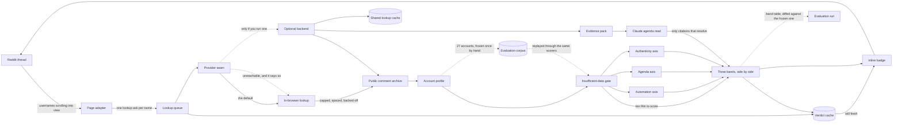

# Architecture — Bot Detector

A Chrome extension that badges Reddit commenters as you scroll, with **three
separate scores** — is a machine posting this, is this account pushing
something, and is there positive evidence of a real person. Everything below
runs in the browser by default: no account, no sign-up and no server. This is
the repo's half of the `docs/` contract that generates its page on jiolab.dev;
the other half is `docs/project.json`, and `features[].nodes` there names the
ids declared here. Renaming an id is a breaking change.

## Three paths, drawn as three paths on purpose

`automation`, `agenda` and `authenticity` never meet before `verdict`, and
`verdict` holds three bands side by side rather than an average. That is the
product's whole argument, so it is enforced in code — there is no combined
number anywhere — and the diagram is drawn to match.

The reason is a specific failure. A human paid to post talking points has a real
account age, organic posting hours and varied language: they score **clean on
every automation signal there is**, correctly, because no machine is involved.
Average the axes and that account — the exact case this exists to find — lands
mid-scale next to an opinionated human, and the tool has failed at its only job.

`automation` is about *mechanism* and nothing content-shaped belongs in it.
`agenda` is about the *shape of participation* and no automation signal belongs
in it. `authenticity` exists because a tool that can only accuse never answers
the question that was asked: three suspicion scores over a normal person are
three shrugs, and everyone ends up looking slightly guilty. It looks for things
that are hard to fake *and pointless to fake* — admitting error, staying in an
argument, caring about unrelated subjects — so a low score there means no
positive evidence was found, which is not the same statement as the other two.

## `gate` is all-or-nothing, and a thin account gets no score at all

Under 15 comments or under 14 days of history and all three axes return
`insufficient-data` — its own band, its own visibly neutral badge. Thin history
never returns a *low* score. Absence of evidence must not read as innocence and
must not read as guilt: scoring a three-day-old account "low automation" hands
out a clean bill of health the data cannot support, and scoring it suspicious
smears every new user on the platform.

The same rule runs one level down. A signal that could not be measured is
emitted with a null strength and excluded from its axis average rather than
counted as a clean zero, and an axis needs at least half its total signal weight
actually measured before it reports a band.

Coverage rides on every verdict for the same reason: a report over 100 of an
account's 2,568 comments says so, in the headline sentence, and `profile`
derives that itself so no caller downstream can forget it.

## An empty answer from `archive` is not an answer about the account

`archive` is three endpoints rather than one: an index of accounts carrying
karma and lifetime totals, and two newest-first streams of comments and posts.
The index turns out to have been taken once, in March 2025, and never
refreshed since — so an account whose first comment came after that date does
not exist to it, however busy it is today. Treating that empty answer as "no
such account" is one line of code, and it cost 35 of one live thread's 236
authors their verdict: badged as deleted, suspended or mistyped while the
endpoint next door served their comments perfectly normally. A re-probe eleven
days later put it at one author in five, and that growth is the proof it is a
cutoff and not a delay — a lag shrinks, a cutoff widens every day. The blind
spot was therefore precisely the newest accounts, which is the shape a bought
account takes.

Absence now has to be agreed by all three endpoints before `profile` reports
it. A miss in the index alone yields a profile assembled from the streams
alone, carrying what that costs out loud: no karma, an age that is a floor
rather than a total — which can only push a verdict towards `gate`, never
towards a clean score — and a line on the badge that names our source instead
of blaming the person. A request that *fails* still fails, because an outage is
not an absent account, and falling back on one would turn a broken endpoint
into a stream of confident-looking thin profiles.

## Two signals once fired on the shape of our own pagination

`profile` is not a naive merge of what came back, and the guard in it was
written after both suites passed straight through two false positives found
only by running against live accounts.

**A forged 12-year dormancy.** Comments and posts are fetched as separate
newest-first windows of different depths. An account with 1.59M comments
returned its newest 299 — about an hour — plus one submission from 2014. Merged
naively that reads as a twelve-year dormancy followed by a revival, the single
heaviest `agenda` signal, firing on nothing but our own paging. `profile` now
discards everything older than the oldest item of any truncated stream: below
that point we cannot tell absence from not-having-asked.

**A human sleep-cycle alibi for a bot.** The same 300 comments spanned under six
hours and so left 18 hours of the day empty, which the hour histogram read as a
sleep cycle — a perfect alibi manufactured by the fetch window. A claim about
days now needs days of span before it may be made. That one fix moved the
account from 48 to 62.

**The guard has a price, and `automation` pays it by reading the window twice.**
Discarding everything past the truncation point is right, and it still disarms the
heaviest signal in the axis on exactly the accounts that earn it: the more an
account posts, the less calendar one lookup covers, so the hour histogram goes
unmeasured and sheer volume buys immunity from the strongest check there is.
AutoModerator's reliable window is 297 items spanning 82 seconds. So the same
window is now read as a schedule *and* as a rate — 82 seconds cannot support an
hour histogram, but 297 items in 82 seconds is a ratio of two things we did
observe, because throughput survives truncation where a schedule does not. That
signal only ever accuses: below a pace a person sustains it reports nothing
rather than a clean zero, since an unremarkable posting rate is not evidence of
a human, it is what every account on the platform has. It moved five declared
bots up and no human by a point.

`conversation-depth` was gated at its other end for the same reason. Never
replying to anyone is broadcasting rather than talking and still scores, but
replying to *everyone* is what a summon-bot does by definition, so an account
with no top-level comment anywhere in the window is now unmeasured instead of
being handed the strongest vote for a person this axis can cast.
`u/RemindMeBot` had been collecting exactly that, 299 replies out of 299, from
the mechanism that makes it a bot.

A passing test suite is not evidence this thing works. Any change to the fetch
window, the pagination or a timing signal deserves a live account before it is
believed.

## `authenticity`'s "range of interests" signal used to reward omnipresence

That signal scored reach alone — how many groups, how much sits outside the
largest — and every sitewide utility bot maxed it: `u/AutoModerator` answers in
307 groups with 98% of itself outside the largest one, so it read a flat 1.000,
the strongest vouch this signal can give, for doing exactly what makes it a
bot. Being everywhere is not the same claim as being interested in many
things, and every declared bot in the frozen corpus was scoring `high` here.

The signal now also prices depth: items per group. In the corpus no bot
returns to a group more than 2.06 times and no human fewer than 3.08 — visit-
once and come-back-for-more do not overlap — so full credit needs an account
to average three items per group, and reach below that is tapered toward zero.
A taper rather than dropping the signal outright: on the axis that exists to
vouch, an unmeasured signal only hands its weight to the others, which would
have raised every gamed bot's score instead of lowering it.

A live sweep found the corpus margin was the corpus's own — real accounts run
as low as 2.53 items per group, not 3.08, so the actual gap above the busiest
bot is 0.47 rather than 1.02, thinner than the frozen numbers suggested but
still no overlap. The same sweep caught the taper docking a genuine 25-item
account for looking sitewide when it was really just short: below 45 grouped
items — the smallest history in which an account could satisfy both reach and
depth at once — the measure stops describing where an account spent its
history and starts describing how little of one it has, so the taper is now
withheld below that floor and the account keeps full reach credit instead of
paying for its size.

## A quoted stranger's words aren't questions the account asked

`asks-questions` treated a `?` inside a markdown link's visible text as
something its author typed — right for `hey [does anyone know?](url)`, wrong
for a bot whose template quotes strangers' post titles:
`\#1: [Is it possible to bring this dog back to the states?](url)`. Link text
now counts only on a line where a word outside the brackets shows the author
wrote something there too; a line that is nothing but quoted titles has none.
u/sneakpeekbot had been credited with 97 of its 299 comments this way, on the
signal that exists to vouch for a person; it now gets zero.

The same quoted titles were the only thing making its templated line look
different from the next one. Once they were gone, `near-duplicate-bodies`
found 196 of 197 compared comments identical instead of 28, so the same
fabricated text that had been inflating `authenticity` was suppressing
`automation` underneath it — stripped correctly, one account moved 19 points
up on one axis in the same pass that moved it 13 down on the other.

## `corpus` turns the headline result into a command

The claim the whole thing rests on is that the axes separate the accounts they
ought to. That used to be a table in a write-up of one live run, and not one of
the 25 profiles behind it was kept — so "the separation has not regressed" was a
sentence rather than something anybody could run, and every later proposal to
reweight a signal was unfalsifiable.

`corpus` is 27 accounts frozen as serialised `profile` output: those 25 — 17
humans off a single thread and 8 declared bots — plus 2 prolific commenters
taken off a ranking rather than a thread, kept as a cohort of their own because
a different sampling rule is a different claim and averaging the two would hide
which one an invariant actually rests on. Nothing between `profile` and
`verdict` touches the network or keeps state, so replaying the corpus through
the same scorers is JSON in and arithmetic out — `table` is that run, and a band
that has moved since the last one is printed as a diff and exits non-zero. As it
stands the humans score 0–25 on `automation`, the bots 44–75, and nothing at all
sits in between.

Two things about `corpus` are worth saying out loud rather than leaving in a
comment. **The humans' words are not in it.** Eight accounts that declare
themselves bots keep their real text, because there the boilerplate *is* the
evidence and nobody's privacy is in it; the other nineteen are people —
seventeen who argued about politics one afternoon, two picked off a
prolific-commenter ranking — and none of them agreed to be committed to a public
repository, so their comment bodies are replaced with filler matched on every
measurement a signal actually reads — character length, word count, whether a
question was asked. The one property that cannot survive that swap is repetition
across comments, so the capture scores the real account *and* the stand-in and
records both, which puts the price of the substitution in the repository as a
number instead of an assurance.

**And a bot has to prove it is one.** The ground truth is the account's own
words — "I am a bot" — checked against the committed text on every run, never a
label somebody typed once, and never the username: a name-based rule would have
called `u/KevinGreeneSolar` a marketing account, and it is a person. That bar is
high enough to be awkward. Eight of ten unmistakable bots never say it in a
sentence — they publish an opt-out link, a version number or nothing — and
`u/RemindMeBot` fails it across 299 comments, so it is admitted by citation to a
hand-read instead. That is why the ground truth here is eight accounts rather
than eight hundred, and widening the patterns until more fit through would
destroy the only thing the eight are worth.

None of which makes a green run evidence about live behaviour: it holds the
input fixed, which is exactly what a regression check is and exactly what an
evaluation is not. Both defects above passed a fully green suite.

## `worker` is the only thing that talks to `archive`

Content scripts never fetch. They ask the worker and render what comes back,
which is the only place a concurrency cap, an inter-request gap and a backoff
can be *global*: five open Reddit tabs are five page adapters and one worker, so
the archive — a free service run by a volunteer — sees one polite client rather
than five impatient ones. Badging is driven by visibility, so a 4,000-comment
thread never fires 4,000 lookups, and `cache` holds a verdict for 12 hours under
an LRU cap.

There is also a hard per-lookup request ceiling, and it is a **safety property
rather than a tuning knob**: one badge render must never be able to become a
scraping loop through a pagination bug, a stalled cursor or a pathological
history. Retries count against it, so a failing source cannot spin either.

## Everything right of `provider` is optional, and a degrade is never silent

`provider` resolves to `local` unless a backend is configured, and back to
`local` if a configured one is unreachable — carrying `degraded` and the reason
with every verdict, which the expanded card prints. Local mode looking
indistinguishable from backend mode is how somebody ends up believing a model
read an account when nothing of the sort happened.

`backend` adds exactly two things and nothing else: `llm`, the judgement
pattern-matching cannot make — the difference between narrative repetition and a
person with a hobbyhorse — and `shared`, so a lookup done on one machine is free
on the next. The deterministic verdict is the *extension's own code*, imported
rather than reimplemented; a second implementation would be two answers to one
question, drifting apart silently.

## `pack` is what makes `llm`'s citations checkable

`pack` is built in plain deterministic code — no network, no model — which is
the only reason citation verification is possible: the model can cite only ids
this pass minted. On return, each cited id is resolved against the pack that was
actually sent. An id that does not resolve is dropped and reported; a finding
left with no resolvable citation is rejected; if nothing survives there is no
model block at all rather than an unsupported one.

The model is asked for evidence and a band, never a verdict on a person and
never an identity claim, and the schema gives it nowhere to put one. A confident
paragraph about a stranger's chess is merely wrong; a confident paragraph about
a stranger's motives reads as true whether or not it is, and the person it
describes is not in the room to object.

`pack` also selects a spread across the account's history rather than the newest
N, because the newest N answers a different question and overweights whatever
the account is arguing about today — and its cap is a privacy budget as much as
a token budget, since every comment in it is a piece of a real stranger's
posting.
