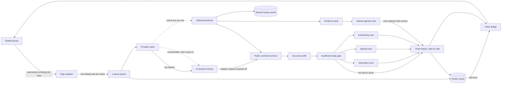

# Architecture — Bot Detector

A Chrome extension that badges Reddit commenters as you scroll, with **three
separate scores** — is a machine posting this, is this account pushing
something, and is there positive evidence of a real person. Everything below
runs in the browser by default: no account, no sign-up and no server. This is
the repo's half of the `docs/` contract that generates its page on jiolab.dev;
the other half is `docs/project.json`, and `features[].nodes` there names the
ids declared here. Renaming an id is a breaking change.

## Three paths, drawn as three paths on purpose

`automation`, `agenda` and `authenticity` never meet before `verdict`, and
`verdict` holds three bands side by side rather than an average. That is the
product's whole argument, so it is enforced in code — there is no combined
number anywhere — and the diagram is drawn to match.

The reason is a specific failure. A human paid to post talking points has a real
account age, organic posting hours and varied language: they score **clean on
every automation signal there is**, correctly, because no machine is involved.
Average the axes and that account — the exact case this exists to find — lands
mid-scale next to an opinionated human, and the tool has failed at its only job.

`automation` is about *mechanism* and nothing content-shaped belongs in it.
`agenda` is about the *shape of participation* and no automation signal belongs
in it. `authenticity` exists because a tool that can only accuse never answers
the question that was asked: three suspicion scores over a normal person are
three shrugs, and everyone ends up looking slightly guilty. It looks for things
that are hard to fake *and pointless to fake* — admitting error, staying in an
argument, caring about unrelated subjects — so a low score there means no
positive evidence was found, which is not the same statement as the other two.

## `gate` is all-or-nothing, and a thin account gets no score at all

Under 15 comments or under 14 days of history and all three axes return
`insufficient-data` — its own band, its own visibly neutral badge. Thin history
never returns a *low* score. Absence of evidence must not read as innocence and
must not read as guilt: scoring a three-day-old account "low automation" hands
out a clean bill of health the data cannot support, and scoring it suspicious
smears every new user on the platform.

The same rule runs one level down. A signal that could not be measured is
emitted with a null strength and excluded from its axis average rather than
counted as a clean zero, and an axis needs at least half its total signal weight
actually measured before it reports a band.

Coverage rides on every verdict for the same reason: a report over 100 of an
account's 2,568 comments says so, in the headline sentence, and `profile`
derives that itself so no caller downstream can forget it.

## Two signals once fired on the shape of our own pagination

`profile` is not a naive merge of what came back, and the guard in it was
written after both suites passed straight through two false positives found
only by running against live accounts.

**A forged 12-year dormancy.** Comments and posts are fetched as separate
newest-first windows of different depths. An account with 1.59M comments
returned its newest 299 — about an hour — plus one submission from 2014. Merged
naively that reads as a twelve-year dormancy followed by a revival, the single
heaviest `agenda` signal, firing on nothing but our own paging. `profile` now
discards everything older than the oldest item of any truncated stream: below
that point we cannot tell absence from not-having-asked.

**A human sleep-cycle alibi for a bot.** The same 300 comments spanned under six
hours and so left 18 hours of the day empty, which the hour histogram read as a
sleep cycle — a perfect alibi manufactured by the fetch window. A claim about
days now needs days of span before it may be made. That one fix moved the
account from 48 to 62.

A passing test suite is not evidence this thing works. Any change to the fetch
window, the pagination or a timing signal deserves a live account before it is
believed.

## `worker` is the only thing that talks to `archive`

Content scripts never fetch. They ask the worker and render what comes back,
which is the only place a concurrency cap, an inter-request gap and a backoff
can be *global*: five open Reddit tabs are five page adapters and one worker, so
the archive — a free service run by a volunteer — sees one polite client rather
than five impatient ones. Badging is driven by visibility, so a 4,000-comment
thread never fires 4,000 lookups, and `cache` holds a verdict for 12 hours under
an LRU cap.

There is also a hard per-lookup request ceiling, and it is a **safety property
rather than a tuning knob**: one badge render must never be able to become a
scraping loop through a pagination bug, a stalled cursor or a pathological
history. Retries count against it, so a failing source cannot spin either.

## Everything right of `provider` is optional, and a degrade is never silent

`provider` resolves to `local` unless a backend is configured, and back to
`local` if a configured one is unreachable — carrying `degraded` and the reason
with every verdict, which the expanded card prints. Local mode looking
indistinguishable from backend mode is how somebody ends up believing a model
read an account when nothing of the sort happened.

`backend` adds exactly two things and nothing else: `llm`, the judgement
pattern-matching cannot make — the difference between narrative repetition and a
person with a hobbyhorse — and `shared`, so a lookup done on one machine is free
on the next. The deterministic verdict is the *extension's own code*, imported
rather than reimplemented; a second implementation would be two answers to one
question, drifting apart silently.

## `pack` is what makes `llm`'s citations checkable

`pack` is built in plain deterministic code — no network, no model — which is
the only reason citation verification is possible: the model can cite only ids
this pass minted. On return, each cited id is resolved against the pack that was
actually sent. An id that does not resolve is dropped and reported; a finding
left with no resolvable citation is rejected; if nothing survives there is no
model block at all rather than an unsupported one.

The model is asked for evidence and a band, never a verdict on a person and
never an identity claim, and the schema gives it nowhere to put one. A confident
paragraph about a stranger's chess is merely wrong; a confident paragraph about
a stranger's motives reads as true whether or not it is, and the person it
describes is not in the room to object.

`pack` also selects a spread across the account's history rather than the newest
N, because the newest N answers a different question and overweights whatever
the account is arguing about today — and its cap is a privacy budget as much as
a token budget, since every comment in it is a piece of a real stranger's
posting.
